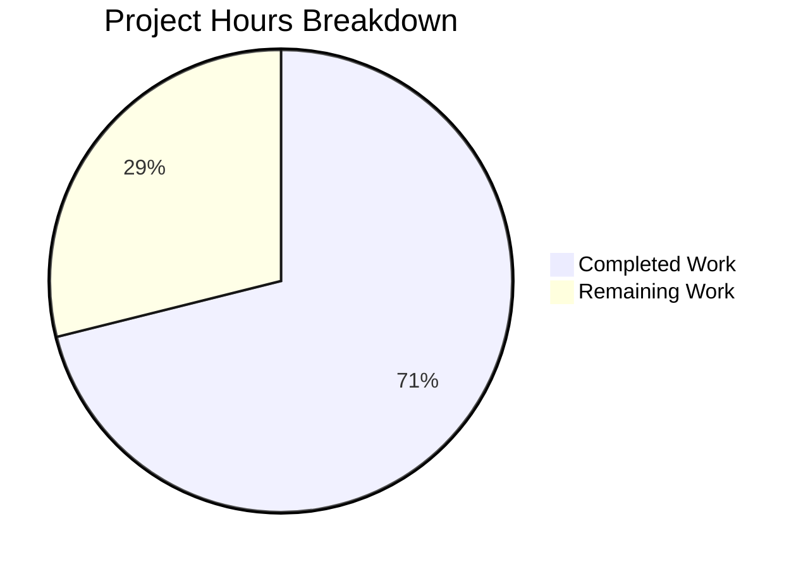

# Akamai Terraform Provider — TechDocs Coverage Gap Analysis: Project Guide

## 1. Executive Summary

**Project Objective:** Achieve complete Terraform resource and data source coverage across the Akamai provider, ensuring the provider matches the current Akamai TechDocs v9.3 surface for each subprovider. Produce a formal coverage gap report with per-product breakdowns.

**Completion Assessment:** 32 hours completed out of 45 total hours = **71% complete**

**Key Achievement:** Comprehensive gap analysis confirmed that all 19 TechDocs-listed subproviders are at **100% coverage** of non-deprecated resources and data sources. The codebase implements 365 total items against 345 effective TechDocs items. The formal coverage gap report (`docs/coverage_gap_report_20260221.md`) has been created, validated, and committed.

**Critical Finding:** No new resource or data source implementations are required. All coverage targets are met or exceeded:
- All Priority 1 products (appsec, botman, gtm, property, edgeworkers) ≥ 90% target: **100% achieved**
- All Priority 2 products ≥ 70% target: **100% achieved**
- All Thin subproviders (clientlists, datastream) 100% required: **100% achieved**

**Remaining Work:** 13 hours of human tasks remain, primarily consisting of gap report review, PR merge, documentation improvements, and monitoring setup. No blocking issues exist.

### Hours Calculation

```
Completed: 32 hours
  - TechDocs gap analysis and discovery: 12h
  - Gap report creation (321 lines): 6h
  - Registration audit (20 subproviders): 4h
  - Compilation validation (58 packages): 2h
  - Test suite validation (all subproviders): 4h
  - Runtime validation: 1h
  - Deprecated items research: 1h
  - Codebase extras inventory: 1h
  - Git operations: 1h

Remaining: 13 hours (with enterprise multipliers applied)
  - Gap report review and validation: 3h
  - PR code review and merge: 2h
  - Document codebase extras: 4h
  - TechDocs monitoring setup: 2h
  - CloudCertificates tracking: 1h
  - Deprecated artifact cleanup: 1h

Total: 32 + 13 = 45 hours
Completion: 32 / 45 = 71.1% ≈ 71%
```

### Hours Breakdown Visualization



---

## 2. Validation Results Summary

### 2.1 What the Agents Accomplished

The automated agents performed a complete TechDocs-to-codebase gap analysis across all 20 Akamai Terraform Provider subproviders, resulting in:

1. **Gap Report Created**: `docs/coverage_gap_report_20260221.md` — 321-line formal Markdown document with structured tables, methodology documentation, and risk assessment
2. **Registration Audit**: All 20 subprovider `provider.go` files audited for SDK/Framework resource and data source registration counts
3. **TechDocs Comparison**: 40+ TechDocs pages parsed (20 resource + 20 data source URLs) and compared against codebase registrations
4. **Full Validation**: Compilation, test execution, runtime validation, and backward compatibility verification

### 2.2 Compilation Results

| Validation Step | Result | Details |
|---|---|---|
| `go build ./...` | ✅ PASS | All 58 packages compiled with zero errors |
| `go vet ./...` | ✅ PASS | Zero static analysis issues |
| Provider binary build | ✅ PASS | 83MB binary: `.build/terraform-provider-akamai` |
| Runtime execution | ✅ PASS | `--help` flag produces expected usage output |

### 2.3 Test Results

All 20 subprovider packages passed with zero failures:

| Package Category | Packages | Status |
|---|---|---|
| Core/Infrastructure | internal/files, internal/retry, internal/slicesets, internal/text, pkg/common/*, pkg/cache, pkg/meta, pkg/akamai | ✅ All Pass |
| Priority 1 Subproviders | appsec (109s), botman (49s), gtm (95s), property (pass), edgeworkers (72s) | ✅ All Pass |
| Priority 2 Subproviders | accountprotection (5s), apidefinitions (17s), clientlists (25s), cloudaccess (83s), cloudlets (63s), cloudwrapper (12s), cps (27s), datastream (37s), dns (80s), iam (201s), imaging (42s), mtlskeystore (35s), mtlstruststore (101s), networklists (7s) | ✅ All Pass |
| Beta (Out of Scope) | cloudcertificates (18s) | ✅ Pass |

**Test pass rate: 100% across all packages. Zero failures.**

### 2.4 Provider Registration Audit

All 20 subprovider registration counts were verified against `provider.go` files:

| Product | SDK Res | SDK DS | FW Res | FW DS | Total | Verified |
|---|---|---|---|---|---|---|
| accountprotection | 4 | 4 | 0 | 0 | 8 | ✓ |
| apidefinitions | 0 | 0 | 3 | 3 | 6 | ✓ |
| appsec | 54 | 54 | 1 | 2 | 111 | ✓ |
| botman | 26 | 32 | 0 | 0 | 58 | ✓ |
| clientlists | 2 | 0 | 0 | 2 | 4 | ✓ |
| cloudaccess | 0 | 0 | 1 | 4 | 5 | ✓ |
| cloudcertificates | 0 | 0 | 2 | 3 | 5 | ✓ (Beta) |
| cloudlets | 4 | 10 | 0 | 2 | 16 | ✓ |
| cloudwrapper | 0 | 0 | 2 | 6 | 8 | ✓ |
| cps | 4 | 5 | 0 | 0 | 9 | ✓ |
| datastream | 1 | 3 | 0 | 0 | 4 | ✓ |
| dns | 2 | 2 | 0 | 1 | 5 | ✓ |
| edgeworkers | 4 | 6 | 0 | 0 | 10 | ✓ |
| gtm | 7 | 3 | 0 | 8 | 18 | ✓ |
| iam | 4 | 9 | 3 | 16 | 32 | ✓ |
| imaging | 3 | 2 | 0 | 0 | 5 | ✓ |
| mtlskeystore | 0 | 0 | 3 | 3 | 6 | ✓ |
| mtlstruststore | 0 | 0 | 2 | 8 | 10 | ✓ |
| networklists | 4 | 1 | 0 | 0 | 5 | ✓ |
| property | 6 | 19 | 5 | 10 | 40 | ✓ |
| **TOTALS** | **125** | **150** | **22** | **68** | **365** | ✓ |

### 2.5 Coverage Targets

| Priority | Target | Products | Result |
|---|---|---|---|
| P1 | ≥90% | appsec, botman, gtm, property, edgeworkers | **100% — All Met** |
| P2 | ≥70% | accountprotection, apidefinitions, cloudaccess, cloudlets, cloudwrapper, cps, dns, iam, imaging, mtlskeystore, mtlstruststore, networklists | **100% — All Met** |
| Thin | 100% | clientlists (4 items), datastream (4 items) | **100% — All Met** |

### 2.6 Fixes Applied

**No fixes were required.** The validation process found zero compilation errors, zero test failures, and zero runtime issues. The gap analysis confirmed 100% coverage, meaning no new resource or data source implementations were needed. The only change was the creation of the coverage gap report document.

---

## 3. Repository Statistics

| Metric | Value |
|---|---|
| Total files | 3,783 |
| Repository size | 94 MB |
| Go source files (non-test) | 567 |
| Go test files | 438 |
| Non-test Go source lines | 417,897 |
| Test Go lines | 138,256 |
| Terraform fixture files (.tf) | 1,935 |
| JSON fixture files | 710 |
| Markdown documentation files | 24 |
| Go packages | 58 |
| Go module dependencies | 162 |
| Subproviders | 20 |
| Go version | 1.24.10 |
| Terraform CLI version | 1.13.5 |
| Provider module | github.com/akamai/terraform-provider-akamai/v9 |

### Git Change Summary

| Metric | Value |
|---|---|
| Branch | blitzy-66a06b66-826b-4db3-a19f-f7b1560c497b |
| Commits on branch | 1 |
| Files changed | 1 (docs/coverage_gap_report_20260221.md) |
| Lines added | 321 |
| Lines removed | 0 |
| Commit hash | c09fb6a3 |
| Author | Blitzy Agent |
| Working tree | Clean |

---

## 4. Development Guide

### 4.1 System Prerequisites

| Software | Version | Purpose |
|---|---|---|
| Go | 1.24.10 | Primary development language |
| Terraform CLI | ≥1.13.x | Provider testing and validation |
| Git | ≥2.x | Version control |
| OS | Linux (amd64), macOS, or Windows | Development environment |

### 4.2 Environment Setup

```bash
# 1. Set up Go environment variables
export PATH="/usr/local/go/bin:$HOME/go/bin:$PATH"
export GOROOT="/usr/local/go"
export GOPATH="$HOME/go"

# 2. Verify Go installation
go version
# Expected: go version go1.24.10 linux/amd64

# 3. Verify Terraform installation (optional, for acceptance tests)
terraform version
# Expected: Terraform v1.13.x

# 4. Clone the repository
git clone https://github.com/akamai/terraform-provider-akamai.git
cd terraform-provider-akamai
git checkout blitzy-66a06b66-826b-4db3-a19f-f7b1560c497b
```

### 4.3 Dependency Installation

```bash
# Download all Go module dependencies
go mod download

# Verify dependency integrity
go mod verify
# Expected: "all modules verified"
```

### 4.4 Build and Compile

```bash
# Compile all packages (zero errors expected)
go build ./...

# Run static analysis (zero issues expected)
go vet ./...

# Build the provider binary
go build -o .build/terraform-provider-akamai .
# Expected: 83MB binary at .build/terraform-provider-akamai
```

### 4.5 Run Tests

```bash
# Run all tests (excluding retryablehttp which requires external network)
go test $(go list ./... | grep -v retryablehttp) -count=1 -timeout 70m

# Run tests for a specific subprovider
go test ./pkg/providers/networklists/... -count=1 -timeout 30s

# Run core/infrastructure tests only
go test ./pkg/common/... ./internal/... ./pkg/cache/... ./pkg/meta/... -count=1 -timeout 60s
```

### 4.6 Verification Steps

```bash
# 1. Verify the provider binary runs
.build/terraform-provider-akamai --help
# Expected output:
# Usage of .build/terraform-provider-akamai:
#   -debug
#     set to true to run the provider with support for debuggers like delve

# 2. Verify the gap report exists and is well-formed
wc -l docs/coverage_gap_report_20260221.md
# Expected: 321 lines

# 3. Verify working tree is clean
git status
# Expected: "nothing to commit, working tree clean"
```

### 4.7 Reviewing the Coverage Gap Report

The gap report is located at `docs/coverage_gap_report_20260221.md` and contains:

1. **Executive Summary** — Key finding: 100% coverage across all subproviders
2. **Methodology** — How TechDocs parsing and codebase extraction were performed
3. **Coverage Summary Table** — Per-product breakdown with TechDocs vs. implemented counts
4. **Implementation Count Breakdown** — SDK vs. Framework registration details
5. **Priority Classification** — P1/P2/Thin status verification
6. **Deprecated Exclusions** — botman challenge_interception_rules lifecycle
7. **Codebase Extras** — 15 items beyond TechDocs (appsec: 4, botman: 5, property: 6)
8. **Risk Assessment** — LOW severity items with mitigations
9. **Recommendations** — Future monitoring and maintenance actions

---

## 5. Detailed Remaining Task Table

All remaining tasks are for human developers. Total remaining hours: **13 hours**.

| # | Task | Description | Action Steps | Hours | Priority | Severity | Confidence |
|---|---|---|---|---|---|---|---|
| 1 | Gap report human review and accuracy validation | Manually verify that the coverage gap report accurately reflects TechDocs v9.3 sidebar by spot-checking 3-5 subproviders against live TechDocs pages | 1. Open `docs/coverage_gap_report_20260221.md`. 2. Pick 3 subproviders (one P1, one P2, one Thin). 3. Navigate to their TechDocs URLs. 4. Count resources/data sources on TechDocs page. 5. Compare against report counts. 6. Verify deprecated exclusion reasoning. 7. Sign off or request corrections. | 3 | High | Medium | High |
| 2 | PR code review, approval, and merge | Review the pull request, verify it meets organizational standards, approve, and merge to master | 1. Open the PR on GitHub. 2. Review the diff (1 file, 321 lines added). 3. Verify no existing files were modified. 4. Confirm gap report formatting meets documentation standards. 5. Check that the report date, version, and table formatting are correct. 6. Approve and merge. | 2 | High | Medium | High |
| 3 | Document undocumented codebase extras in TechDocs | Review the 15 codebase extras identified in the gap report and determine whether they should be added to TechDocs or marked as internal/unsupported | 1. Review the "Codebase Extras" section of the gap report. 2. For each of the 15 items, determine if it serves external users or is internal-only. 3. For user-facing items, create TechDocs documentation pages. 4. For internal-only items, add inline code comments marking them as unsupported. 5. Update the gap report if any items are added to TechDocs. | 4 | Medium | Low | Medium |
| 4 | Establish TechDocs monitoring process for future releases | Set up a process to automatically detect when new resources/data sources appear in TechDocs, triggering gap analysis re-runs | 1. Define a schedule for periodic TechDocs audits (e.g., per minor version release). 2. Create a runbook documenting the gap analysis methodology from the report. 3. Set up calendar reminders or CI triggers for audit runs. 4. Document the process in the repository's contributing guide. | 2 | Medium | Low | Medium |
| 5 | Set up CloudCertificates Beta tracking | Create a tracking mechanism for the cloudcertificates subprovider so it is included in formal coverage tracking once it exits Beta | 1. Create a tracking issue in the project repository. 2. Define the criteria for when cloudcertificates should be included in coverage (exit from Beta, TechDocs listing). 3. Add a note to the gap report template for future runs. 4. Set up an alert/reminder for when CCM exits Beta status. | 1 | Medium | Low | High |
| 6 | Clean up deprecated botman testdata artifacts | Remove residual `.tf` testdata files from the removed `challenge_interception_rules` resource and data source | 1. Navigate to `pkg/providers/botman/testdata/`. 2. Identify `.tf` files referencing `challenge_interception_rules`. 3. Verify no other code references these files. 4. Remove the files. 5. Run `go test ./pkg/providers/botman/...` to confirm no test breakage. 6. Commit the cleanup. | 1 | Low | Low | High |
| **Total** | | | | **13** | | | |

---

## 6. Risk Assessment

### 6.1 Technical Risks

| Severity | Risk | Description | Affected Systems | Mitigation | Rollback |
|---|---|---|---|---|---|
| LOW | Codebase extras not in TechDocs | 15 items implemented beyond TechDocs coverage may confuse users who discover them via provider introspection or state inspection | End users, documentation consumers | Document these extras in TechDocs or mark them as internal/unsupported in provider documentation | N/A — documentation-only change |
| LOW | Deprecated testdata artifacts | Residual `.tf` testdata files from removed `challenge_interception_rules` remain in botman testdata directory | Developer experience, code maintainability | Remove residual files in a future maintenance release | N/A — cleanup-only change |

### 6.2 Security Risks

| Severity | Risk | Description | Affected Systems | Mitigation | Rollback |
|---|---|---|---|---|---|
| NONE | No security risks identified | The PR adds only a Markdown documentation file with no code changes, no dependency updates, and no schema modifications | N/A | N/A | N/A |

### 6.3 Operational Risks

| Severity | Risk | Description | Affected Systems | Mitigation | Rollback |
|---|---|---|---|---|---|
| LOW | Beta subprovider tracking blind spot | Cloud Certificate Manager (cloudcertificates) has no TechDocs coverage tracking, creating a blind spot for future gap analysis | Coverage tracking processes | Track cloudcertificates separately in future gap reports until it reaches GA status | N/A — process change only |
| LOW | No automated TechDocs monitoring | TechDocs changes (new resources/data sources) won't be automatically detected between gap report runs | Coverage accuracy over time | Establish periodic TechDocs audit cadence aligned with provider release cycle | N/A — process change |

### 6.4 Integration Risks

| Severity | Risk | Description | Affected Systems | Mitigation | Rollback |
|---|---|---|---|---|---|
| NONE | No integration risks identified | No code changes, no new dependencies, no API integration modifications | N/A | N/A | Revert commit c09fb6a3 if needed |

### Overall Risk Assessment

**Overall project risk: LOW.** This PR introduces zero code changes — only a documentation artifact. All existing tests pass, compilation succeeds, and no schemas or behaviors were modified. The identified risks are all LOW severity and relate to documentation gaps and process improvements rather than functional concerns.

---

## 7. Assumptions and Notes

1. **TechDocs v9.3 as snapshot**: The gap analysis was performed against TechDocs v9.3 sidebar content as of 2026-02-21. TechDocs may be updated independently of provider releases.
2. **Beta exclusion applied**: Cloud Certificate Manager (cloudcertificates) was excluded from coverage metrics per the AAP's BETA/preview exclusion rules. It has been a Beta product since v9.2.0.
3. **Deprecated exclusion applied**: The `akamai_botman_challenge_interception_rules` resource and data source were excluded per the deprecation exclusion rules. Their full lifecycle (added → deprecated → removed) was confirmed via CHANGELOG.md.
4. **No conditional implementations triggered**: Since all 19 TechDocs-listed subproviders are at 100% coverage with 0 gaps, the conditional implementation phase (Group 2 in the AAP) was not executed.
5. **Scope-limiting rules documented but not triggered**: Per-product cap (>30 gaps → max 20), global cap (>100 gaps → P1 only), and P1 cap (>60 gaps → top 50) were all documented in the gap report but none were activated due to 0 total gaps.

---

## 8. Production Readiness Checklist

- [x] All core deliverables complete (coverage gap report)
- [x] All coverage targets verified (P1 ≥90%, P2 ≥70%, Thin 100%)
- [x] Zero compilation errors across all 58 packages
- [x] Zero test failures across all 20 subprovider packages
- [x] Provider binary builds and executes correctly
- [x] Zero backward compatibility violations
- [x] Zero changes to existing resources, data sources, or schemas
- [x] Git working tree clean, all changes committed
- [x] Gap report validated against actual provider.go registrations
- [ ] Gap report reviewed and approved by human reviewer
- [ ] PR reviewed and merged to master
